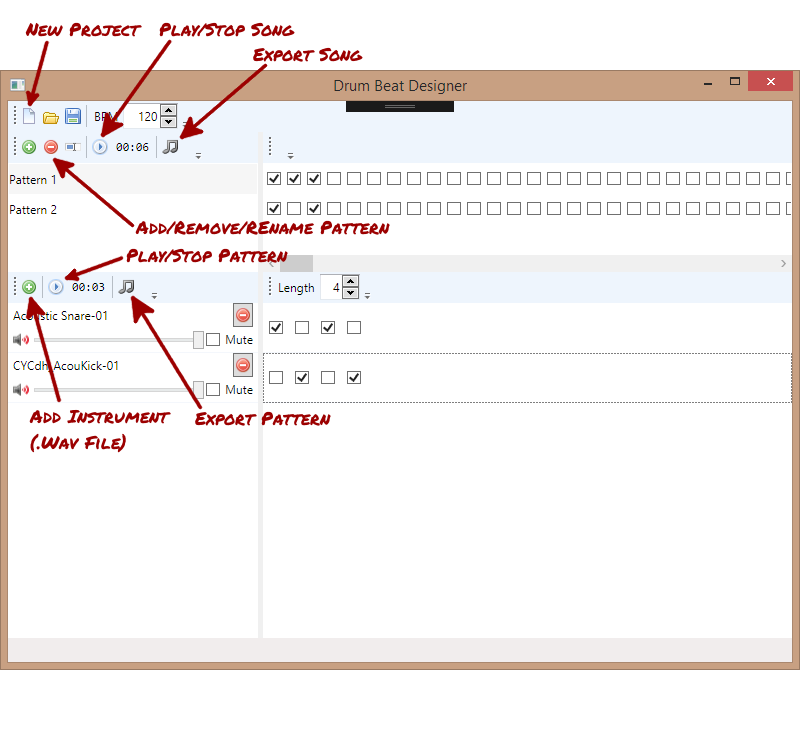

# drum-beat-designer

Drum Beat Designer is a very simple drum machine for Windows. It started as a fun project to help me learn both WPF and .NET audio processing using the NAudio library.

## Installation

DrumBeatDesigner can be built by running build_dist.bat. Output will be in the dist directory.

## Usage

Run DrumBeatDesigner.exe in the dist directory.

No drum samples are included with this program but many can be found around the internet. For example, [SampleRadar: 1,000 free drum samples](http://www.musicradar.com/news/drums/sampleradar-1000-free-drum-samples-229460).

## Todo

- [ ] Prompt for save when starting new project or closing program.
- [ ] Undo functionality (multiple levels).
- [ ] Style beat checkboxes.
